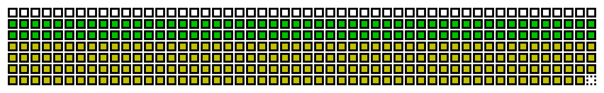
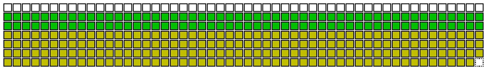

# calendarimg.sh Examples

## default

```bash
for i in {0..362};do
    CALENDARIMG_DATA[i]=$(( i % 7 ));
done
```



## modify_cell_width

```bash
CALENDARIMG_CELL_WIDTH=40
for i in {0..362};do
    CALENDARIMG_DATA[i]=$(( i % 7 ));
done
```


