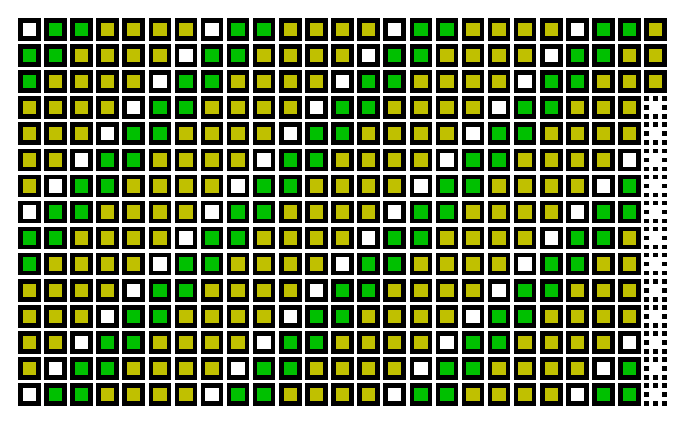

# calendarimg.sh Examples

## Default

```bash
for i in {0..362};do
    CALENDARIMG_DATA[i]=$(( i % 7 ));
done
```


## Modify cell width

```bash
CALENDARIMG_CELL_WIDTH=40
for i in {0..362};do
    CALENDARIMG_DATA[i]=$(( i % 7 ));
done
```


## Modify border

```bash
CALENDARIMG_BORDER=1
for i in {0..362};do
    CALENDARIMG_DATA[i]=$(( i % 7 ));
done
```


## Modify border style

```bash
CALENDARIMG_BORDER_STYLE="dashed"
CALENDARIMG_NODATA_BORDER_STYLE="solid"
for i in {0..362};do
    CALENDARIMG_DATA[i]=$(( i % 7 ));
done
```


## Modify border style by direction

```bash
CALENDARIMG_BORDER_STYLE="dashed solid"
CALENDARIMG_NODATA_BORDER_STYLE="solid dashed"
for i in {0..20};do
    if [[ $((i % 2)) -gt 0 ]];then
        continue
    fi
    CALENDARIMG_DATA[i]=1;
done
```


## Modify border style by side

```bash
CALENDARIMG_BORDER_STYLE="dashed solid hidden dashed"
CALENDARIMG_NODATA_BORDER_STYLE="solid hidden dashed solid"
for i in {0..20};do
    if [[ $((i % 2)) -gt 0 ]];then
        continue
    fi
    CALENDARIMG_DATA[i]=1;
done
```


## Modify padding

```bash
CALENDARIMG_PADDING=10
for i in {0..362};do
    CALENDARIMG_DATA[i]=$(( i % 7 ));
done
```


## Modify margin and background color

```bash
CALENDARIMG_MARGIN=50
CALENDARIMG_COLOR_BG="0 0 192"
for i in {0..362};do
    CALENDARIMG_DATA[i]=$(( i % 7 ));
done
```


## Modify major

```bash
CALENDARIMG_MAJOR="col"
for i in {0..362};do
    CALENDARIMG_DATA[i]=$(( i % 7 ));
done
```


## Modify rows

```bash
CALENDARIMG_ROWS=15
for i in {0..362};do
    CALENDARIMG_DATA[i]=$(( i % 7 ));
done
```



## Modify cols

```bash
CALENDARIMG_COLS=30
for i in {0..362};do
    CALENDARIMG_DATA[i]=$(( i % 7 ));
done
```


## Modify level colors

```bash
CALENDARIMG_LEVEL_LIMITS[0]=2
CALENDARIMG_LEVEL_LIMITS[1]=3
CALENDARIMG_LEVEL_LIMITS[2]=4
CALENDARIMG_LEVEL_LIMITS[3]=5
CALENDARIMG_LEVEL_LIMITS[4]=6
CALENDARIMG_LEVEL_LIMITS[5]=7

CALENDARIMG_LEVEL_COLORS[0]="255 0 0"
CALENDARIMG_LEVEL_COLORS[1]="255 165 0"
CALENDARIMG_LEVEL_COLORS[2]="255 255 0"
CALENDARIMG_LEVEL_COLORS[3]="0 128 0"
CALENDARIMG_LEVEL_COLORS[4]="0 0 255"
CALENDARIMG_LEVEL_COLORS[5]="75 0 130"
CALENDARIMG_LEVEL_COLORS[6]="238 130 238"

for i in {0..362};do
    CALENDARIMG_DATA[i]=$(( i % 7 + 1));
done
```


## Show summary number

```bash
CALENDARIMG_SUMMARY_NUMBER=enabled
for i in {0..362};do
    CALENDARIMG_DATA[i]=$(( i % 7));
done
```


## Reversed data

```bash
CALENDARIMG_DATA_ORDER=reversed
for i in {0..362};do
    CALENDARIMG_DATA[i]=$(( i % 7));
done
```


## Lack of item

```bash
CALENDARIMG_COLOR_BR="192 192 0"
CALENDARIMG_COLOR_NDBR="0 0 192"
for i in {0..362};do
    if [[ $((i % 13)) -eq 0 ]];then
        continue
    fi
    CALENDARIMG_DATA[i]=$(( i % 7));
done
```


